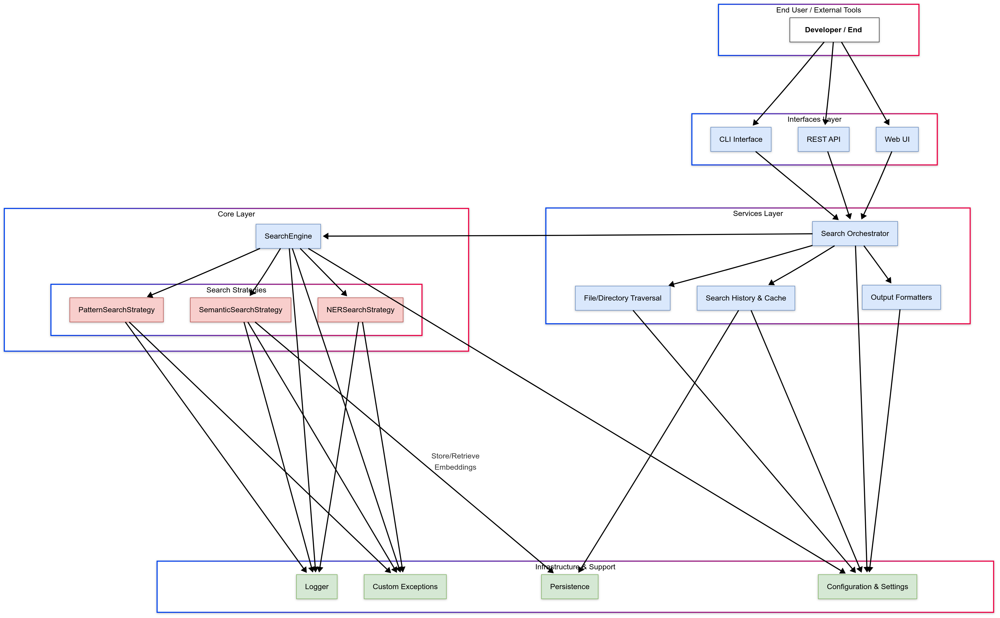

# Plan

Build a simple utility to search text files.

- Use a test driven development approach to gradually build up the functionality.
- Learn as you go, document the process.
- Open source the entire development process.
- Make it fun!

## Features

In order of priority, going from simplest to most complex:

- [x] **Pattern-based Search**: Find specific types of data (GUIDs, emails, dates, phone numbers, etc.) using RegEx patterns.
- [ ] **Semantic Search**: Find content based on meaning using embedding models that capture semantic similarity between query and the document text.
- [ ] **Entity Recognition**: Identify people, organizations, and locations in input text using NLP models.
- [ ] **Multi-file/Directory Search**: Search across multiple files and directories, or use wildcards to define search scope.
- [ ] **Context Display**: Show surrounding lines of text around matches for better understanding of results.
- [ ] **Configurable Output Formats**: Support for colored terminal output, JSON, CSV, or markdown for easier integration into other tools/workflows.
- [ ] **Search History & Caching**: Remember previous searches and cache results for frequently searched files.
- [ ] **Regular Expression Support**: Allow customer regex pattern search beyond the built in ones.
- [ ] **File Type Filtering**: Limit searches to specifi file types or exclude certain files.
- [ ] **Syntax Highlighting**: Colorize code or highlighted matched patterns for better readability.
- [ ] **Batch Processing**: Run multiple search queries at once and combine results.
- [ ] **Vector Database Integration**: Store embeddings in a vector database for faster semantic search on large datasets/files.
- [ ] **Customer AI Models**: Allows users to specify their own embedding or NER models.
- [ ] **Search Within Results**: Perform secondary searches withing initial search results.
- [ ] **Diff/Compare View**: Compare search results across different files or versions
- [ ] **Saved Searches/Templates**: Save complex search queries as templates for reuse.
- [ ] **Web Interface**: Add a simple web UI for non-technical users.
- [ ] **CLI Interface**: Add a CLI interface through python package for technical users.
- [ ] **REST API**: Add a REST API for programmatic access to the search functionality.

## Release Plan

### Iniitial Releases

- v0.1.0 - Pattern-based search
  - Basic pattern matching (GUID, email, date, URL, IP)
  - Multi-file/directory search with wildcard support
  - Context line display (configurable)
  - Colored terminal output
  - Basic CLI interface
  - Core error handling
- v0.1.1 (Enhancement)
  - Additional patterns (phone, SSN, credit card, etc.)
  - Improved output formatting
  - Search result highlighting
  - Basic configuration options
  - Performance improvements for large files

### AI Integration

- v0.2.0 (Semantic Core)
  - Semantic search using sentence-transformers
  - Basic chunking strategies for text content
  - Similarity threshold configuration
  - Optional AI dependencies management
  - Expanded CLI options for semantic search
- v0.2.1 (Entity Recognition)
  - Named entity recognition (NER) using spaCy
  - Entity type filtering (PERSON, ORG, GPE, etc.)
  - Combined pattern + entity search
  - Custom spaCy model support
  - Search result categorization by entity type

### Usability Improvements

- v0.3.0 (Workflow Improvements)
  - Search history tracking and recall
  - Result caching for performance
  - Custom regex pattern support
  - File type filtering and exclusions
  - JSON and CSV output formats
- v0.3.1 (Search Extensions)
  - Fuzzy matching for text search
  - Syntax highlighting for code and structured content
  - Improved context awareness
  - Batch processing for multiple queries
  - Search within previous results

### Advanced Features

- v0.4.0 (Infrastructure Expansion)
  - Vector database integration (Qdrant/FAISS)
  - Persistent embedding storage
  - Custom embedding model support
  - Large file/dataset optimization
  - Parallel processing for performance
- v0.4.1 (Expert Features)
  - Diff/compare view between search results
  - Advanced filtering and sorting options
  - Saved search templates
  - Complex query composition
  - Embedding visualization tools

### Complete Solution

- v0.5.0 (API Foundation)
  - REST API core implementation
  - Basic authentication
  - API documentation
  - Python client library
  - Programmatic access to all search features
- v0.5.1 (Web Interface)
  - Basic web UI implementation
  - Results visualization
  - Real-time search capabilities
  - User preferences
  - Export functionality
- v1.0.0 (Production Release)
  - Polished CLI, Web, and API interfaces
  - Comprehensive documentation
  - Performance optimization
  - Docker deployment support
  - Cross-platform compatibility
  - Plugin architecture for extensions

### Future Roadmap

- v1.1.0 - Advanced analytics and reporting
- v1.2.0 - Team collaboration features
- v1.3.0 - Integration with popular development tools
- v2.0.0 - AI-powered search recommendations and learning

## Tech Stack

- python

## Architecture

